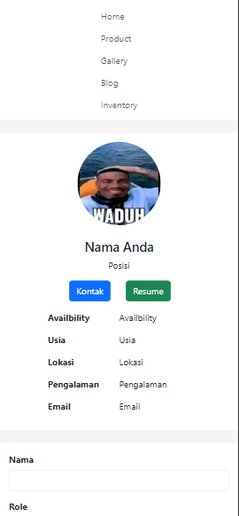
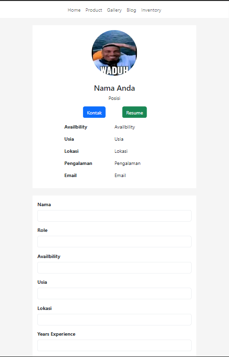
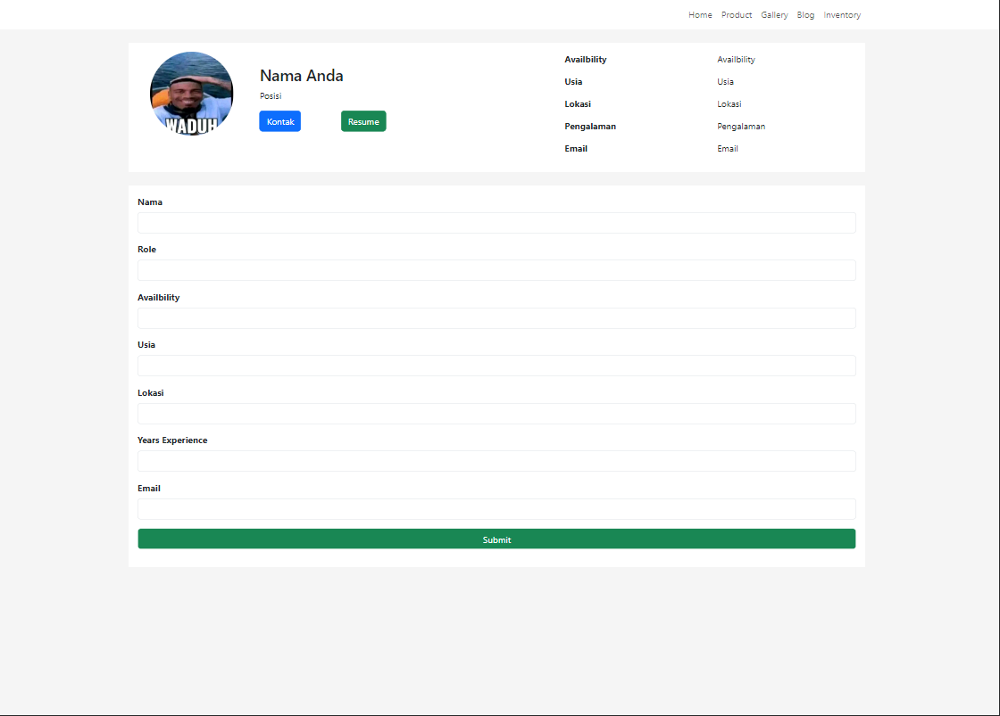

# assignment-1-bithealth

This repository contains `HTML` and `CSS` file for form section website. `Boostrap` CSS Framework was used in this work. 

In general, the web structure consist of these sections: 
```
├── nav-bar
│   ├── HOME
│   └── PRODUCT
│   └── GALLERY
│   └── BLOG
│   └── INVENTORY
├── status
│   ├── PHOTO
|   └── IDENTITY
│   └── STATUS
```

## Website view 

1. Mobile view, using `.xs` breakpoint 
<p align="center">
    

2. Tablet view, using `.sm` breakpoint 
<p align="center">
    

3. Small laptop and desktop view, using `.md` breakpoint 
<p align="center">
    

